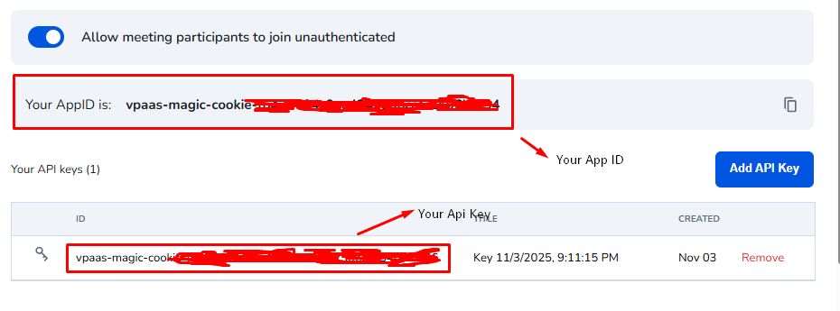
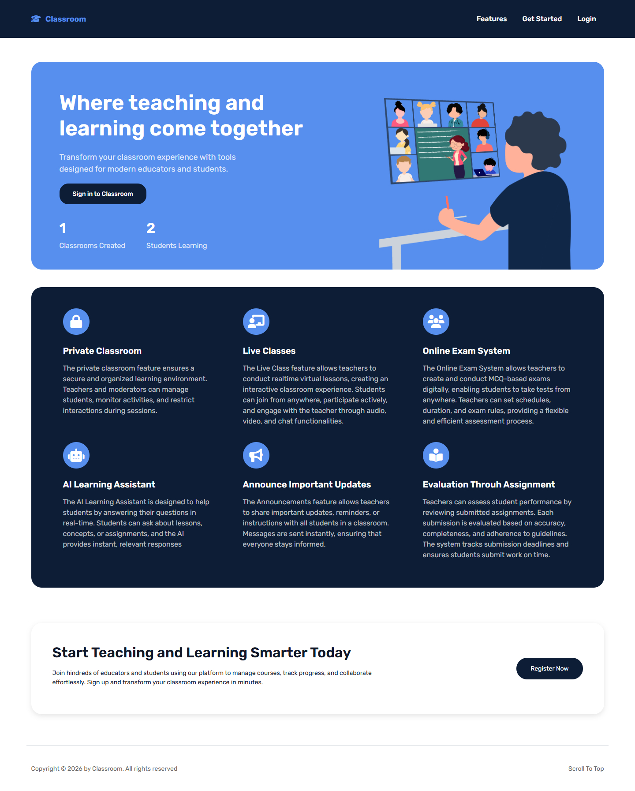
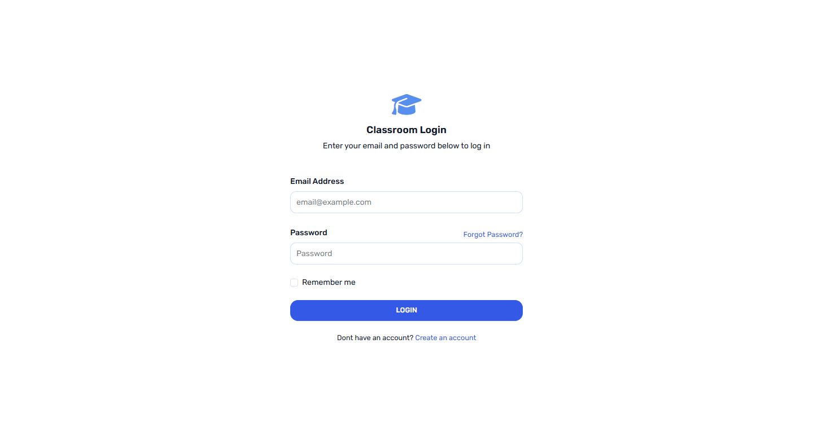
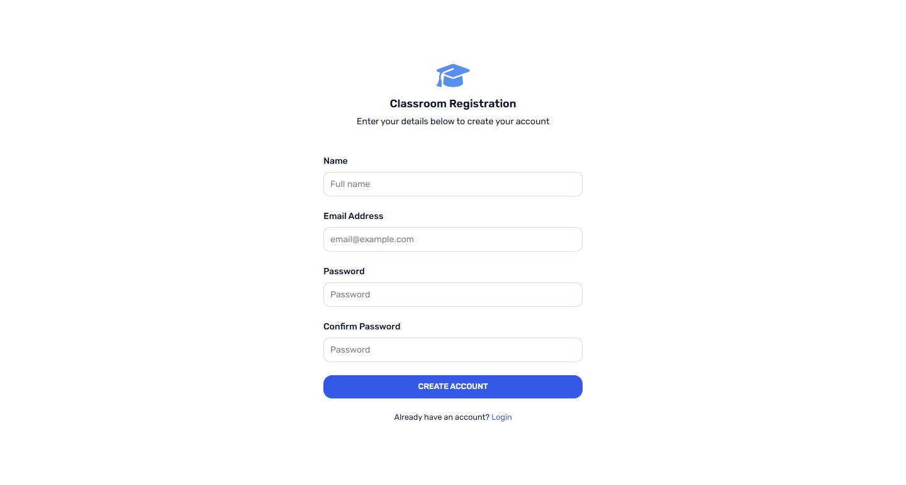
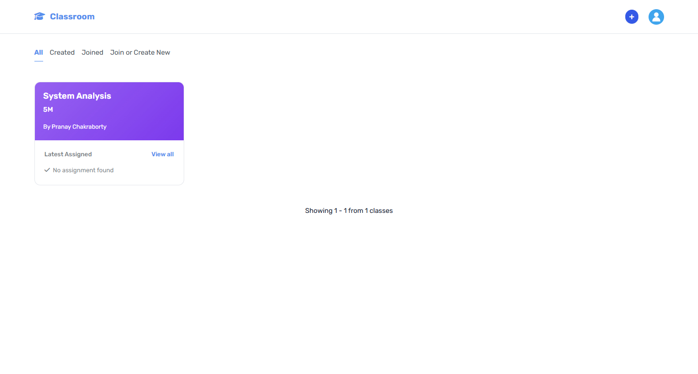
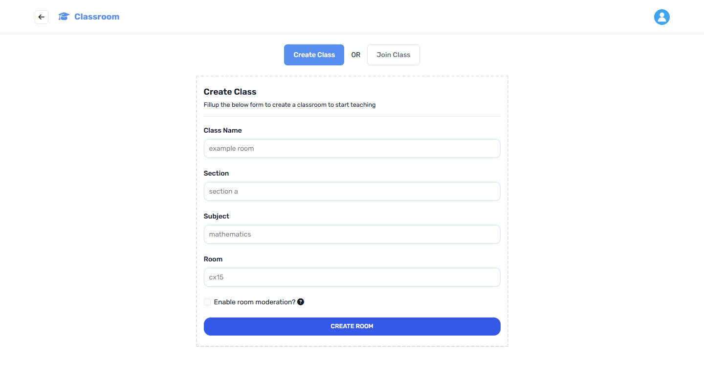
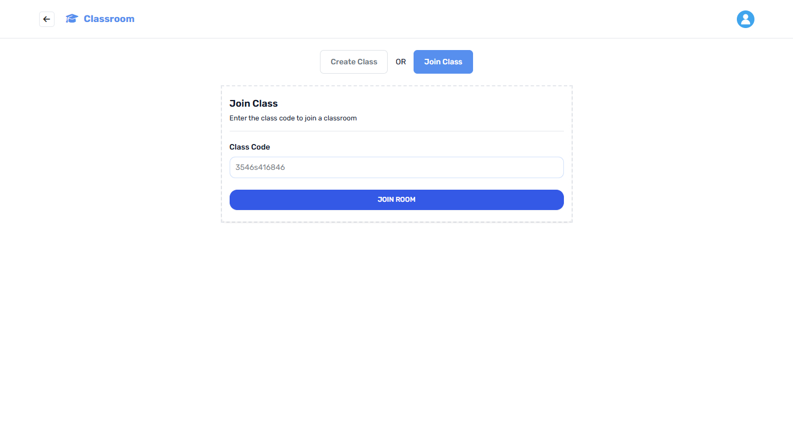
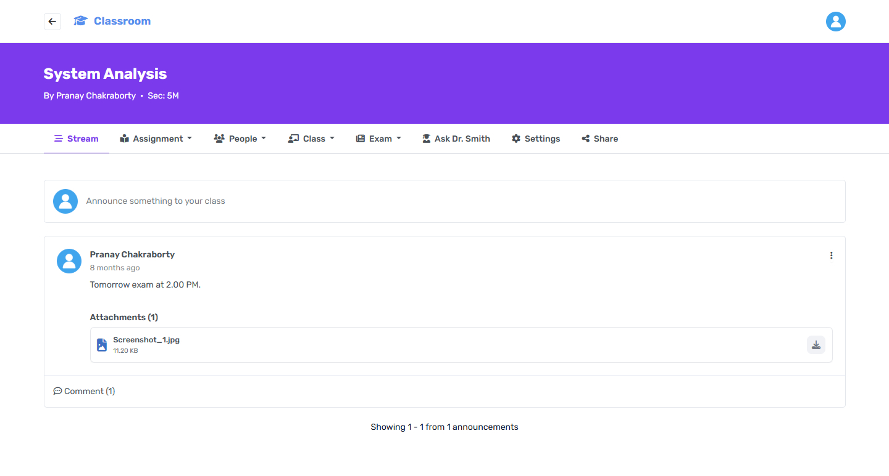
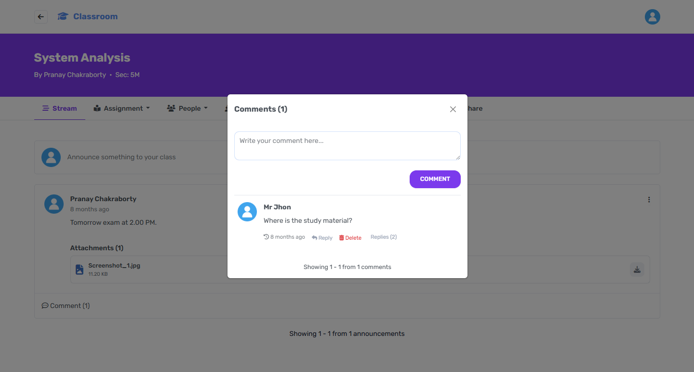

# Classroom

A modern, feature-rich classroom management platform built with Laravel and Vue.js. This application replicates and enhances the core functionality of Google Classroom with additional features for better learning management.

## ✨ Features

- **User Authentication & Authorization** - Secure login and register system.
- **Class Management** - Create, join, and manage classes.
- **Announcement** - Share important updates with students with comment support.
- **Assignment System** - Create, submit, and grade assignments.
- **Real-time Notifications** - Stay updated with class activities through email notification.
- **Interactive Dashboard** - Overview of all classes and activities.
- **File Upload System** - Submit assignments with file attachments.
- **Online Exam System** - Powerful online exam system with negetive marking support for better competetive environment.
- **Online Classes** - Jitsi Meet powered online class system.
- **Moderator** - Assign moderator role to a participant to reduce your pressure.
- **Moderator Permission** - Describe which module the moderator can access.
- **AI Assistant** - Dr. Smith - gemini powered ai assistant to solve your daily problems.
- **Responsive Design** - Fully responsive mobile-first interface.

## 🛠️ Tech Stack

- **Backend Framework:** Laravel 12
- **Frontend Framework:** Vue.js 3
- **Server-side Rendering:** Inertia.js 2
- **Database:** MySQL / PostgreSQL
- **CSS Framework:** Bootstrap 5x

## 📋 Prerequisites

Before you begin, ensure you have the following installed:

- PHP 8.2+
- Composer
- Node.js 18+
- NPM or Yarn
- MySQL 8.0+ or PostgreSQL 14+
- Git

## 🚀 Installation

Follow these steps to get your development environment running:

### 1. Clone the Repository

```bash
git clone https://github.com/pranaycb/classroom.git
cd classroom
```

### 2. Install PHP Dependencies

```bash
composer install
```

### 3. Set Up Environment Configuration

```bash
cp .env.example .env
```

### 4. Configure Environment Variables
Create a new database before configuring the ```env``` file. Open ```.env``` and update the following:

```bash
# Database Configuration
DB_CONNECTION=mysql
DB_HOST=127.0.0.1
DB_PORT=3306
DB_DATABASE=add_your_database_name
DB_USERNAME=add_your_database_username
DB_PASSWORD=add_your_database_password

# Email Smtp Configuration
MAIL_MAILER=log
MAIL_SCHEME=null
MAIL_HOST=127.0.0.1
MAIL_PORT=2525
MAIL_USERNAME=null
MAIL_PASSWORD=null
MAIL_FROM_ADDRESS="hello@example.com"
MAIL_FROM_NAME="${APP_NAME}"

# Gemini Configuration
GEMINI_API_KEY= add_your_gemini_api_key

# Jitsi Meet Configuration
JAAS_APP_ID= add_your_jitsi_meet_app_id
JAAS_API_KEY= add_your_jitsi_meet_api_key
```
### 5. Generate Jitsi Meet Api Key
Go to the ```https://jaas.8x8.vc``` and create an account and log in. Then go to the ```API Keys``` page from your dashboard and click ```Add API Key``` button. It will generate your ```app id``` and ```api key``` with public and private key files. Download the ```RSA Public Key``` and ```RSA Private Key``` files and place them inside the ```storage/app/private``` directory. Copy the app id and api key and paste in your ```.env``` file.


```bash
JAAS_APP_ID= paste_your_jitsi_meet_app_id
JAAS_API_KEY= paste_your_jitsi_meet_api_key
```

### 6. Generate Gemini Api Key
Go to the ```https://aistudio.google.com``` and login to your google account. From the sidebar go to the Dashboard. You will the option to create an api key. Give your api key a name, copy the key and paste it in your ```.env``` file.
```bash
GEMINI_API_KEY= paste_your_gemini_api_key
```

### 7. Generate Application Key
```bash
php artisan key:generate
```
### 8. Migrate Database
```bash
php artisan migrate
```
### 9. Run the application
```bash
composer run dev
```
This will run run the application server, queue server, and vite server together. You dont need to manully run them.

Your application will be accessible at: ```http://localhost:8000```

## Code Style

- PHP: PSR-12
- CSS: Bootstrap components and utilities
- Vue.js: Vue 3 Composition API

## License
This project is licensed under the MIT License.

## Author
- Name: Pranay Chakraborty
- Email: pranaycb.ctg@gmail.com

## 📸 Screenshots

### Landing Page


### User Authentication
| Login | Register |
|-------|----------|
|  |  |

### Dashboard


### Create & Join Classes
| Create Class | Join Class |
|--------------|------------|
|  |  |

### Class Stream


### Comment on Class Stream


## Need Help?
Pull requests are welcome. For major changes, please open an issue first to discuss what you would like to change.

If you have any problem regarding the file please feel free to contact me via email.

Happy Coding 🤗🤗
